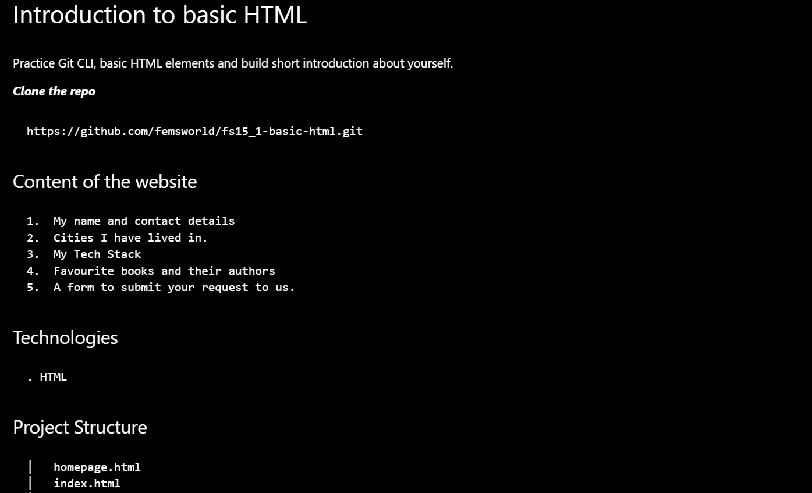

# Introduction to basic HTML
Practice Git CLI, basic HTML elements and build short introduction about yourself.

***Clone the repo***
```
https://github.com/femsworld/fs15_1-basic-html.git
```
## Content of the website
```
1.	My name and contact details
2.	Cities I have lived in.
3.	My Tech Stack
4.	Favourite books and their authors
5.	A form to submit your request to us.
```
## Technologies
```
. HTML
```
## Project Structure
```
│   homepage.html
│   index.html
│   readme-example.png
│   README.md
│   sample.text
│   
└───images
    └───icons
```
## Result
Image showing the Readme page

